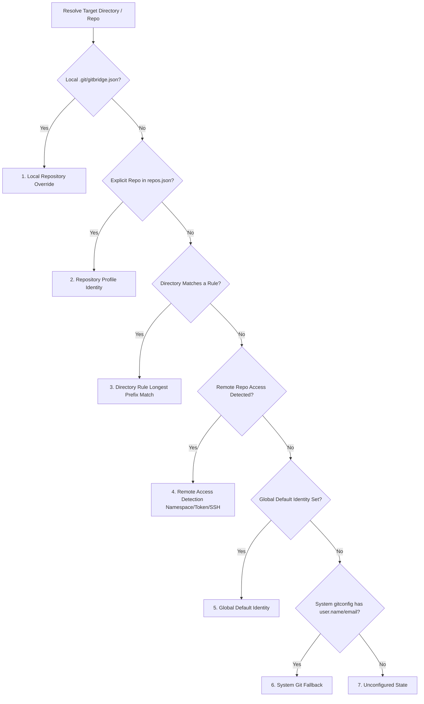

# GitBridge: Universal Git Identity & Multi-Account Management Layer

Welcome to **GitBridge**! This document provides essential architectural context, directory layout, core concepts, command references, and development guidelines for AI assistants (Antigravity, Cursor, Claude Code, Copilot, etc.) working in this repository.

---

## 1. Project Overview & Mission

> **GitBridge is a cross-platform Git context manager that automatically maps a repository to the correct Git identity, provider account, authentication credentials, and SSH configuration while preserving the standard Git workflow.**

A developer should be able to work across GitHub, GitLab, Bitbucket, multiple accounts, and multiple emails without constantly changing Git or SSH configurations manually. Everything in GitBridge exists to make that happen.

### The Three Independent Layers
```text
                GITBRIDGE
                    │
       ┌────────────┼────────────┐
       │            │            │
       ▼            ▼            ▼
   IDENTITY      ACCOUNT      PROVIDER
     WHO AM I?   WHICH        WHERE AM I
                 ACCOUNT?     HOSTING CODE?
   (Name, Email, (Username,   (GitHub, GitLab,
   Signing Key)  Keychain)    Bitbucket, Self-Hosted)
```

- **Identity**: Who am I committing as? (Name, Email, Signing Key)
- **Account**: Which provider account am I authenticating with? (Username, OAuth/PAT token in OS Keyring)
- **Provider**: Where is this code hosted? (GitHub, GitLab, Bitbucket, Enterprise/Self-Hosted)
- **Context Engine**: The heart of the architecture that inspects `cwd`, repository, and remote URL to resolve the exact bundle:
  `repository → remote → provider → account → identity → SSH credentials`

### Core Philosophy: Native & Non-Intrusive
- **Zero Runtime Wrapper Overhead**: GitBridge integrates natively into Git and SSH configuration files (`~/.gitconfig` via `includeIf`, `credential.helper`, and `~/.ssh/config`). Standard Git commands (`git commit`, `git push`, IDE GUIs) run directly against the native Git executable without mandatory custom wrappers.
- **Discover Broadly, Configure Narrowly, Activate Lazily**: Scans environment to detect existing Git configurations, configures *only* the providers the user actually uses, and lazily discovers new/self-hosted instances on the fly.
- **Hardware & Native Keychain Security**: Personal access tokens and credentials are saved in OS-native secure storage (macOS Keychain, Linux Secret Service / `libsecret`, Windows Credential Manager / DPAPI) with an AES-256-GCM PBKDF2-derived encrypted vault fallback.
- **Companion IDE Extension**: Includes a first-class editor extension (`extension/`) supporting VS Code, Cursor, and Antigravity IDE for status-bar identity monitoring, one-click switching, and context inspection.

---

## 2. Repository Architecture & Layout

```text
gitbridge/
├── bin/                                # CLI Entrypoints
│   ├── gitbridge.ts                    # Full binary entry: gitbridge <cmd>
│   └── gb.ts                           # Short alias entry: gb <cmd>
├── src/
│   ├── index.ts                        # Main library export
│   ├── cli/                            # Command Line Interface Layer
│   │   ├── index.ts                    # Commander program builder & routing
│   │   ├── commands/                   # Handlers (status, context, explain, current, clone, ssh, etc.)
│   │   └── ui/                         # Clack prompts, cli-table3 views, banners, help
│   ├── core/                           # Domain Core Engine
│   │   ├── config/                     # Schemas (Zod), PathResolver, ConfigStore
│   │   ├── git/                        # Git CLI runner, includeIf generator, injector, proxy
│   │   ├── ssh/                        # SSH config generator, host alias injector, key detector
│   │   ├── storage/                    # OS Keyrings (Linux/macOS/Windows) & Encrypted Vault
│   │   ├── identity/                   # IdentityResolver (precedence resolution engine)
│   │   ├── safety/                     # IdentityGuard & pre-commit hook validator
│   │   ├── ide/                        # IdeSyncManager (VS Code, Cursor, Antigravity, JetBrains)
│   │   └── providers/                  # GitHub, GitLab, Bitbucket API, detector & registry
│   └── utils/                          # Logger, HTTP client, proc runner, platform utilities
├── extension/                          # Companion VS Code / Cursor / Antigravity IDE Extension
│   ├── src/
│   │   ├── extension.ts                # VS Code extension entry point
│   │   ├── controllers/                # Status bar, file watcher, commands
│   │   └── providers/                  # Activity Bar & SCM TreeDataProviders
│   └── test/                           # Extension unit and integration test suite
├── tests/                              # Core Test Suites (Bun Test)
│   ├── unit/                           # Isolated unit tests for all core modules
│   └── integration/                    # End-to-end Git lifecycle and credential tests
├── scripts/
│   └── build.ts                        # Production bundler (esbuild -> dist/)
├── AGENTS.md                           # This AI context & guidance document
└── package.json                        # Scripts, dependencies, binary mappings
```

---

## 3. Storage Model & Data Locations

GitBridge stores its configuration in `~/.gitbridge` (configurable via `GITBRIDGE_HOME` or `XDG_CONFIG_HOME`):

| File Path | Description | Schema / Format |
|---|---|---|
| `~/.gitbridge/config.json` | Main global configuration & directory rules | `MainConfig` (Zod) |
| `~/.gitbridge/identities.json` | Configured Git author profiles | `IdentitiesFile` (Zod) |
| `~/.gitbridge/accounts.json` | Authenticated Git provider accounts | `AccountsFile` (Zod) |
| `~/.gitbridge/repos.json` | Explicit local repository overrides | `RepositoriesFile` (Zod) |
| `~/.gitbridge/vault.enc` | Encrypted fallback token store | AES-256-GCM (PBKDF2) |
| `~/.gitbridge/generated/main.gitconfig` | Compiled Git configuration block | Gitconfig with `includeIf` |
| `~/.gitbridge/generated/ssh_config` | Compiled SSH host alias definitions | SSH client config |
| `~/.gitbridge/generated/rules/*.gitconfig` | Individual directory rule Git configs | Gitconfig with `[user]` & `[url]` |
| `~/.gitbridge/shims/git` | Native Git interceptor shim (Unix/CMD/PowerShell) | Shell script / batch |

---

## 4. Identity Resolution Hierarchy

When GitBridge resolves the active Git author name, email, and signing key for a directory or repository, it applies the following deterministic precedence:



1. **Local Repository Override** (`.git/gitbridge.json`): Direct per-repo setting without modifying global files.
2. **Repository Profile** (`repo_profile`): Stored in `repos.json` or explicitly set via `gb repo set` / `gb init` / `gb switch`.
3. **Directory Rule** (`directory_rule`): Longest prefix match against configured rules in `config.json` (compiled to Git's native `[includeIf "gitdir:~/work/**"]`).
4. **Remote Repository Access Detection** (`remote_access`): Auto-detects authenticated account access via repository namespace ownership, OS Keyring PAT/OAuth API verification, or SSH key routing.
5. **Global Default** (`global_default`): Designated fallback identity in `config.json` (`defaultIdentityId` or `isDefault: true`).
6. **System Fallback** (`system_fallback`): Existing `user.name` and `user.email` from `~/.gitconfig`.
7. **Unconfigured**: No valid identity found.

---

## 5. Dual CLI Commands & Quick Shorthand Reference

GitBridge provides dual binaries: `gitbridge` (verbose) and `gb` (fast shorthand).

### Installation & Setup
- **Linux & macOS (1-liner)**: `curl -fsSL https://cdn.jsdelivr.net/gh/FuadTesfaye/gitbridge@main/install.sh | bash`
- **Windows PowerShell (1-liner)**: `irm https://cdn.jsdelivr.net/gh/FuadTesfaye/gitbridge@main/install.ps1 | iex`
- **npm / Bun**: `npm install -g @fuad24/gitbridge` or `bun add -g @fuad24/gitbridge`

### Setup, Status, Context & Diagnostics
- `gb setup` (`gitbridge setup`): Progressive onboarding wizard (`-q, --quick` for 1-second instant setup).
- `gb st` (`gitbridge status`): Display active identities, accounts, rules, and integration states.
- `gb ctx` (`gitbridge context`): Inspect identity resolution, active remotes, and mismatch warnings (`--json` for machine output).
- `gb cur` (`gitbridge current`): Print active author identity (`-p, --prompt` for compact shell prompt badge).
- `gb explain` (`gitbridge explain`): Decision tree breakdown of WHY an identity was selected across 6 resolution tiers.
- `gb env` (`gitbridge env`): Print shell environment export statements (`GIT_AUTHOR_NAME`, `GIT_SSH_COMMAND`, etc.).
- `gb clone <url> [dir] [-i id] [-a acc] [-e email]` (`gitbridge clone`): Smart clone with automated account access detection (namespace ownership, API token probe, SSH key routing) and persistent repository binding.
- `gb doc` (`gitbridge doctor`): Run comprehensive diagnostics on Git CLI, keyrings, SSH keys, and provider APIs.
- `gb update` (`gb upgrade`): Check for and install the latest version of GitBridge from npm (`-c, --check` to check without installing).
- `gb completion [bash|zsh|fish]`: Generate shell autocompletion script.

### Identity Management
- `gb id ls`: List all configured Git identities.
- `gb id add --id <id> --name "<name>" --email "<email>" [--signing-key <key>] [--default]`: Register new identity.
- `gb id use <id>`: Set an identity as global default.
- `gb id rm <id>`: Delete an identity.

### Provider Accounts & Authentication
- `gb acc ls`: List authenticated accounts.
- `gb acc rm <id>`: Delete an account and erase credentials from OS keychain.
- `gb auth login [github|gitlab|bitbucket] [--token <pat>] [-u <user> -p <pass>] [--host <custom-host>] [--ssh-key <path>]`: Log in to provider.
- `gb auth logout <provider> [username]`: Revoke credentials.
- `gb prov ls`: List supported providers, enabled/authenticated status, accounts count, and capabilities.
- `gb prov enable <id>`: Enable a provider.
- `gb prov disable <id>`: Disable a provider (without erasing credentials).
- `gb prov add`: Interactively select and enable a provider.

### SSH Management
- `gb ssh ls`: List discovered SSH keys and linked accounts.
- `gb ssh gen [--name <n>] [--email <e>]`: Generate a modern ed25519 SSH key.
- `gb ssh link [keyPath] [accountId]`: Associate an SSH key with an authenticated account.

### Repository Profiles & Binding
- `gb repo set [path] [--identity <id>] [--email <email>] [--provider <prov>] [--account <acc>]`: Bind a repository permanently to an identity, email, and provider. Remembers forever without asking again.
- `gb repo ls` (`gb repo list`): List remembered repository bindings.
- `gb repo rm [path]` (`gb repo unset`): Remove repository binding.
- `gb init`: Interactive repository setup wizard.

### Directory Rules
- `gb rules ls`: List directory mapping rules.
- `gb rules add <path> <identityId> [--provider <prov>] [--account <accId>]`: Map a folder to an identity.
- `gb rules rm <idOrPath>`: Remove directory mapping.

### Remotes & Multi-Push
- `gb rem ls`: List remotes for current repository.
- `gb rem add <name> <url> [-a <accountId>]`: Add remote with automatic SSH host alias routing.
- `gb push [target] [--all] [--tags] [-f]`: Push active branch across configured remotes concurrently.

### Security & Secret Scanning
- `gb sec check` (`gb security check`): Full security audit (permissions, remotes, keyring, staged secrets).
- `gb sec fix` (`gb security fix`): Auto-lock permissions to `0700/0600`, scrub remote tokens into Keyring, install hooks.
- `gb sec scan [path]` (`gb security scan`): Scan directory tree for private keys, API tokens, and sensitive files.

### System Integration & Native Git Override
- `gb enable`: Inject GitBridge managed blocks into `~/.gitconfig` and `~/.ssh/config`.
- `gb disable`: Safely remove GitBridge managed blocks and restore backups.
- `gb override enable`: Install shims in `~/.gitbridge/shims` and inject PATH into shell profiles (`.bashrc`, `.zshrc`, `config.fish`, PowerShell).
- `gb override disable`: Remove shims and clean shell profiles.
- `gb override status`: Check shim status and active shell integration.
- `gb ide sync`: Automatically configure `git.path` and environment variables in detected IDEs (VS Code, Cursor, Antigravity, JetBrains).
- `gb ide unsync`: Restore original IDE Git settings.
- `gb ide status`: Check IDE synchronization status across all installed editors.

---

## 6. Development & Verification Commands

Use **Bun** as the primary runtime and test runner:

```bash
# Run complete test suite (unit + integration)
bun test

# Run specific test file
bun test tests/unit/identity-resolver.test.ts

# Run with test coverage
bun test --coverage

# Typecheck codebase without emitting files
bun run typecheck

# Build distribution bundles into dist/
bun run build

# Run local CLI binary directly
bun run bin/gb.ts --help
bun run bin/gb.ts st
```

---

## 7. Guidelines for AI Assistants

When developing, testing, or debugging GitBridge:
1. **Never mutate the user's live Git/SSH environment directly during tests**: Always instantiate `ConfigStore` with an isolated temporary directory via `PathResolver(tmpDir)` or set `GITBRIDGE_HOME=/tmp/test-gitbridge`. When the code under test touches `~/.gitconfig`, `~/.ssh`, shell profiles or editor settings, also pass a sandbox home as the second argument: `new PathResolver(tmpDir, tmpHome)`. `bun test` preloads `tests/setup/isolate-home.ts`, which points `HOME`, `XDG_CONFIG_HOME` and `GITBRIDGE_HOME` at a throwaway directory for the whole run as a last line of defence.
2. **Preserve Native Git Interoperability**: Any change to `src/core/git/` or `src/core/ssh/` must ensure standard `git` and `ssh` commands remain 100% compliant with native Git/SSH behavior.
3. **Respect Progressive Disclosure**: For detailed operational workflows, refer to the Antigravity Skill at [`.agents/skills/gitbridge/SKILL.md`](file:///.agents/skills/gitbridge/SKILL.md) and reference documents in [`.agents/skills/gitbridge/references/`](file:///.agents/skills/gitbridge/references/).
